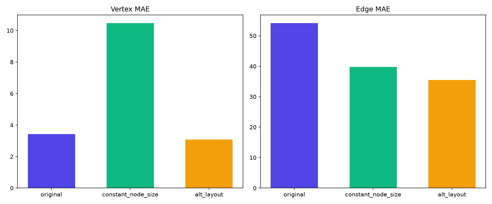
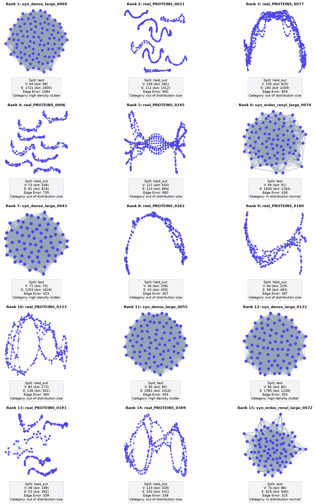
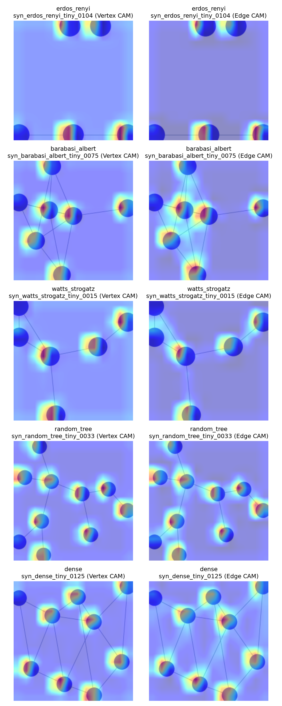
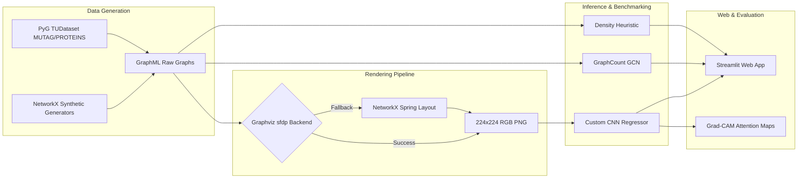

<div align="center">

# 🔭 Topolens

**Visual Topology Regression via Deep Convolutional Networks**

*An empirical investigation into whether 2D visual representations of graphs contain sufficient structural signals to recover graph-level topological invariants (vertex & edge counts) without graph-native message passing.*

[](https://www.python.org/)
[](https://pytorch.org/)
[](https://pyg.org/)
[](https://streamlit.io/)
[](https://opensource.org/licenses/MIT)
[](#-reproducibility--experimental-protocol)

---

[Key Findings](#-key-experimental-findings) •
[System Architecture](#-system-architecture) •
[Quickstart](#-quickstart) •
[Interactive Web App](#-interactive-web-application) •
[Repository Layout](#-repository-structure) •
[Contributing](CONTRIBUTING.md)

</div>

---

## 📌 Overview & Research Statement

**Topolens** explores a fundamental research question at the boundary of Computer Vision and Graph Learning:

> *Can a generic 2D Convolutional Neural Network (CNN) estimate topological properties—specifically node count $|V|$ and edge count $|E|$—purely from rendered 2D bitmap representations of graphs, and how does it compare to graph-native GNN architectures?*

Graph Neural Networks (GNNs) operate natively on graph adjacency matrices and node features via spatial or spectral message passing. However, in many real-world scenarios—such as legacy scientific diagrams, scanned figures, UI wireframes, and biological pathways—only rendered 2D images are available. **Topolens** formulates graph counting as a visual regression task over 224×224 RGB images, benchmarking a 4-block CNN (`CustomCNNRegressor`) against a standard 3-layer Graph Convolutional Network (`GraphCountGCN`) and a non-learned density heuristic.

---

## 📊 Key Experimental Findings & CSV Results

### 1. In-Distribution vs. Held-Out Generalization (`summary_comparison.csv`)

Evaluated on **1,676 test and held-out graphs** across synthetic generators and real-world biological benchmark datasets (MUTAG & PROTEINS):

| Model | Split | Vertex MAE ($|V|$) | Vertex Median | Edge MAE ($|E|$) | Edge Median | Key Characteristics |
|---|---|---|---|---|---|---|
| **Custom CNN** | Synthetic Test | **3.20** | **1.0** | **25.39** | **4.0** | Highly accurate in-distribution |
| **GCN Baseline** | Synthetic Test | 19.05 | 14.0 | 76.21 | 42.0 | Degree-normalized mean pooling |
| **Heuristic** | Synthetic Test | 0.00* | 0.0 | 342.10 | 128.0 | *Trivial node lookup; edge formula fails on scale |
| **Custom CNN** | Held-Out (Real) | **10.62** | **3.0** | **28.03** | **10.0** | Robust on small-to-medium real graphs |
| **GCN Baseline** | Held-Out (Real) | 21.15 | 16.0 | 32.50 | 18.0 | Stable mean-pooling embedding |
| **Heuristic** | Held-Out (Real) | 0.00* | 0.0 | 4927.70 | 2841.0 | Catastrophic failure on large graphs |

---

### 2. Shortcut-Learning & Probe Interventions (`probe_summary.csv`)

Controlled intervention probes ($N=40$ paired graphs) isolate *what* visual features the CNN relies upon:

| Tier / Group | Variant | Vertex MAE | Edge MAE | Sample Size ($N$) | Primary Insight |
|---|---|---|---|---|---|
| **Overall** | `original` | **3.43** | **54.18** | 40 | Baseline canonical render ($sfdp$) |
| **Overall** | `constant_node_size` | **10.48** | **39.80** | 40 | **Vertex MAE triples** ($p = 3.6 \times 10^{-6}$), confirming dot coverage cue |
| **Overall** | `alt_layout` | **3.08** | **35.53** | 40 | No significant layout sensitivity ($p = 0.499$) |
| Large Tier | `original` | 8.90 | 195.50 | 10 | $50 \le N \le 100$ baseline |
| Large Tier | `constant_node_size` | 16.70 | 82.80 | 10 | Vertex error doubles on large graphs |
| Large Tier | `alt_layout` | 7.10 | 122.40 | 10 | Kamada-Kawai layout handles dense clusters well |
| Medium Tier| `constant_node_size` | 15.30 | 51.70 | 10 | $25 \le N \le 50$ (Vertex MAE: $3.50 \to 15.30$) |
| Small Tier | `constant_node_size` | 8.50 | 21.20 | 10 | $10 \le N \le 25$ (Vertex MAE: $1.00 \to 8.50$) |

<div align="center">

  
*Figure 1: Mean Absolute Error (MAE) across original, constant node size, and alternative layout probes.*

</div>

---

### 3. Failure Taxonomy Breakdown (`failure_case_summary.csv`)

Categorization of model errors into domain-specific failure modes:

| Split | Failure Category | Mean Vertex MAE | Median Vertex MAE | Mean Edge MAE | Median Edge MAE | $N$ |
|---|---|---|---|---|---|---|
| Held-Out | `high_density_clutter` | **0.43** | **0.0** | **1.13** | **1.0** | 144 |
| Held-Out | `in_distribution_normal` | **6.67** | **3.0** | **20.79** | **10.0** | 1090 |
| Held-Out | `out_of_distribution_size` | **96.64** | **71.0** | **203.60** | **155.0** | 67 |
| Test | `high_density_clutter` | **1.27** | **1.0** | **51.82** | **4.0** | 110 |
| Test | `in_distribution_normal` | **4.00** | **2.0** | **14.42** | **3.0** | 265 |

<div align="center">

  
*Figure 2: Top 15 worst-case prediction errors with true vs. predicted vertex/edge counts and category labels.*

</div>

---

### 4. Pixel Coverage & Structural Correlations (`ink_coverage_correlations.csv`)

Pearson correlation coefficients ($r$) analyzing pixel coverage vs. topological invariants:

| Split | Metric X | Metric Y | Pearson $r$ | $p$-value | Interpretation |
|---|---|---|---|---|---|
| Test | `ink_fraction` | `num_edges` | **+0.824** | $7.48 \times 10^{-94}$ | Ink fraction strongly tracks edge count in synthetic data |
| Test | `ink_fraction` | `pred_num_edges` | **+0.845** | $1.49 \times 10^{-103}$ | CNN edge output highly aligned with ink coverage |
| Test | `mean_component_area` | `pred_num_vertices` | **+0.627** | $2.10 \times 10^{-42}$ | Connected component size correlates with vertex predictions |
| Held-Out | `ink_fraction` | `pred_num_edges` | **+0.465** | $6.58 \times 10^{-71}$ | Ink shortcut degrades significantly on real biological graphs |
| Held-Out | `ink_fraction` | `num_edges` | **+0.093** | $0.00078$ | Real graphs violate simple pixel-coverage counting assumptions |

---

### 5. Grad-CAM Spatial Interpretability

<div align="center">

  
*Figure 3: Grad-CAM spatial activation maps generated at layer `features[3]` comparing Vertex target attention vs. Edge target attention across generator families.*

</div>

---

## 🏗️ System Architecture

### Pipeline Workflow



### Core Components

1. **Synthetic & Real Dataset Engine** (`data/`):
   - **Synthetic**: 2,500 graphs across 5 generator families (Erdős–Rényi, Barabási–Albert, Watts–Strogatz, Random Trees, Dense ER) × 4 node tiers (tiny $\le 10$, small $10\text{–}25$, medium $25\text{–}50$, large $50\text{–}100$).
   - **Real-World**: MUTAG (188 graphs) & PROTEINS (1,113 graphs), including an out-of-distribution "xlarge" tier up to 620 nodes.
2. **Custom CNN Regressor** (`models/cnn_model.py`):
   - 4-Block Conv2D stack with BatchNorm, ReLU, and MaxPool2D ($3 \to 16 \to 32 \to 64 \to 128$ channels).
   - Adaptive Average Pooling ($3 \times 3$) $\to$ Linear MLP head ($1152 \to 128 \to 2$).
   - Log-transformed targets ($\log(1 + y)$) with MSE loss and Adam optimizer.
3. **Graph Neural Network Baseline** (`models/gnn_baseline.py`):
   - 3-Layer GCN architecture using PyTorch Geometric.
   - Normalized degree node features + `global_mean_pool` size-invariant embeddings.
4. **Grad-CAM Interpretation Engine** (`models/gradcam.py`):
   - Captures activation maps at `features[3]` (last spatial convolutional block) for target-specific (vertex vs. edge) visual attention analysis.

---

## 🚀 Quickstart

### Environment Setup

```bash
# 1. Clone repository
git clone https://github.com/whozahm3d/topolens.git
cd topolens

# 2. Create and activate virtual environment
python -m venv .venv
source .venv/bin/activate  # On Windows: .venv\Scripts\activate

# 3. Install dependencies
pip install -r requirements.txt
```

> [!NOTE]
> **Optional Backend**: Graphviz `sfdp` rendering requires system-level Graphviz binaries installed on your system PATH (`dot`/`sfdp`). If unavailable, `render_graphs.py` gracefully falls back to NetworkX spring layout with an automated `[WARN]` notification.

### Running the Interactive Web App

Launch the production Streamlit application locally:

```bash
streamlit run app/app.py
```

Open `http://localhost:8501` in your browser.

---

## 💻 Interactive Web Application

The Streamlit web application (`app/app.py`) provides an interactive interface for model inspection, prediction, and visual interpretability:

- **Multi-Format Ingestion**: Upload raw graph structures (`.graphml`, `.csv`, `.txt`) or rendered visual graph images (`.png`, `.jpg`).
- **Live Multi-Model Comparison**: Evaluates uploaded topology simultaneously through the CNN, GCN, and Statistical Heuristic models.
- **Dynamic Warning Banner**: Fires context-aware low-confidence alerts when node counts exceed the empirical training distribution ($|V| > 100$) or when density enters the clutter regime ($\text{density} \ge 0.40$).
- **Grad-CAM Heatmap Overlay**: Real-time side-by-side rendering of spatial attention for vertex counting vs. edge counting.
- **Research Insights Suite**: Interactive dashboards covering shortcut probes, layout sensitivity, and ink coverage correlations.

---

## 🧪 Training & Evaluation

### Training Models

All models support automatic CUDA GPU detection (used for Colab T4 training) and fall back to CPU execution:

```bash
# Train CNN Regressor (smoke test: 2 epochs on tiny subset)
python models/train_cnn.py --smoke-test

# Train CNN Regressor (full training)
python models/train_cnn.py

# Train GCN Baseline
python models/train_gnn.py
```

### Running Evaluation & Diagnostics

```bash
# Evaluate checkpoints against test and held-out splits
python evaluation/evaluate.py

# Run error analysis & generate scatter plots
python evaluation/error_analysis.py

# Run failure-case taxonomy classification
python evaluation/failure_taxonomy.py

# Execute controlled shortcut and layout probes
python render/render_probe_variants.py
python evaluation/shortcut_probe.py

# Compute ink coverage & component stats
python evaluation/ink_coverage_analysis.py
```

---

## 📂 Repository Structure

```
topolens/
├── app/
│   ├── app.py                     # Main Streamlit multi-page web application
│   └── .streamlit/config.toml     # UI theme styling & configuration
├── data/
│   ├── raw/                       # Raw GraphML synthetic & real graph files
│   ├── images/                    # Rendered 224x224 graph images
│   ├── processed/                 # Dataset manifests & labels (labels_processed.csv)
│   ├── splits/                    # Train, val, test, and held-out CSV splits
│   ├── generate_synthetic.py      # NetworkX synthetic graph generator
│   ├── load_tu_datasets.py        # PyG MUTAG / PROTEINS dataset importer
│   └── make_splits.py             # Stratified dataset split script
├── render/
│   ├── render_graphs.py           # Core Graphviz/NetworkX graph rendering engine
│   ├── render_probe_variants.py   # Controlled probe variant generator
│   └── novel_uploads/             # User-uploaded application testing images & manifest
├── models/
│   ├── cnn_model.py               # Custom 4-block CNN Regressor architecture
│   ├── gnn_baseline.py            # PyG 3-layer GraphCountGCN model
│   ├── graph_statistic_baseline.py# Density-based statistical baseline
│   ├── dataset.py                 # PyTorch TopolensImageDataset & normalization
│   ├── gradcam.py                 # Grad-CAM attention heatmap generator
│   ├── train_cnn.py               # CNN training loop with checkpointing
│   ├── train_gnn.py               # GCN baseline training loop
│   └── checkpoints/               # Trained PyTorch model checkpoints (.pt)
├── evaluation/
│   ├── evaluate.py                # Multi-model test & held-out evaluation runner
│   ├── error_analysis.py          # Error distribution & faceted scatter plots
│   ├── failure_taxonomy.py        # Out-of-distribution & clutter failure classifier
│   ├── shortcut_probe.py          # Node-size & layout intervention analyzer
│   ├── ink_coverage_analysis.py   # Pixel coverage & connected component analysis
│   └── results/                   # Computed evaluation CSV metrics & summaries
├── notebooks/                     # Exploratory analysis & visualization notebooks
├── report/
│   ├── FINAL_REPORT.md            # Comprehensive research report & submission
│   ├── log.md                     # Technical execution log
│   └── figures/                   # Generated figures, Grad-CAM grids, and plots
├── config.py                      # Central Python environment & path constants
├── config.yaml                    # Global YAML parameter configuration
├── progress_log.md                # Narrative project development log
├── requirements.txt               # Pinned Python package dependencies
├── CONTRIBUTING.md                # Open-source contribution guidelines
└── LICENSE                        # MIT License
```

---

## 🛡️ Reproducibility & Experimental Protocol

- **Deterministic Random Seeds**: All stochastic processes (graph generation, split partitioning, weight initialization, probe sampling) are seeded via `config.yaml` (`project.seed = 42`).
- **Graph ID Hashing**: Individual synthetic graph parameters are derived deterministically using SHA-256 hashes of `graph_id` strings.
- **Checkpoint Compatibility**: Model checkpoints saved during GPU training explicitly support CPU execution (`map_location="cpu"`) and safe dict unpickling (`weights_only=False`).

---

## 📜 License & Citation

Distributed under the **MIT License**. See [`LICENSE`](LICENSE) for details.

If you use **Topolens** in your research or project, please cite:

```bibtex
@misc{topolens2026,
  author = {Whozahm3d},
  title = {Topolens: Visual Topology Regression via Deep Convolutional Networks},
  year = {2026},
  publisher = {GitHub},
  url = {https://github.com/whozahm3d/topolens}
}
```
